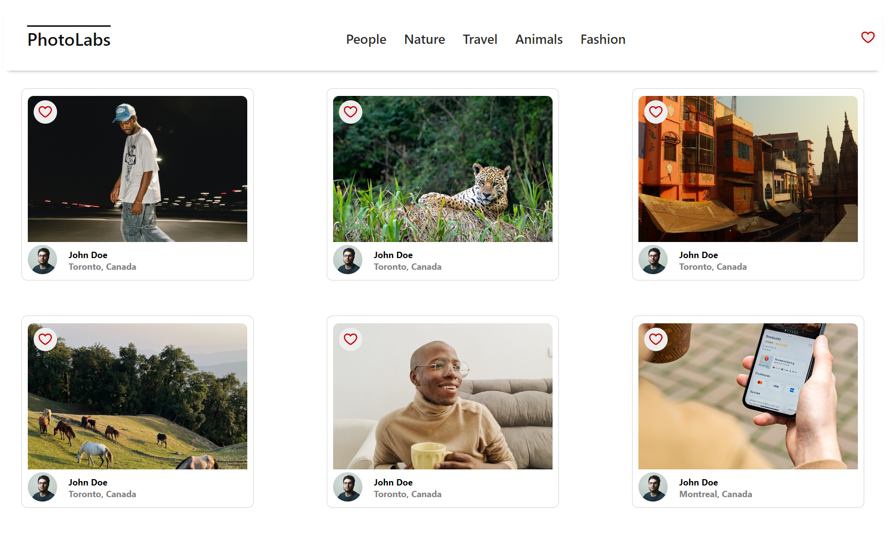
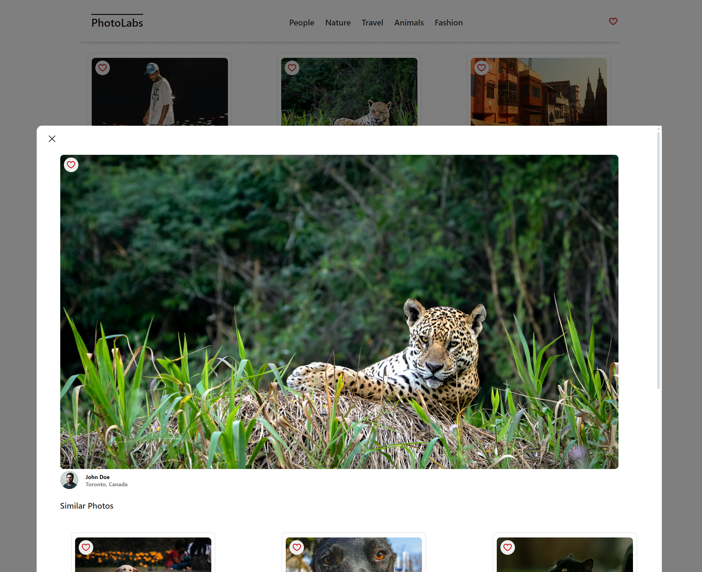
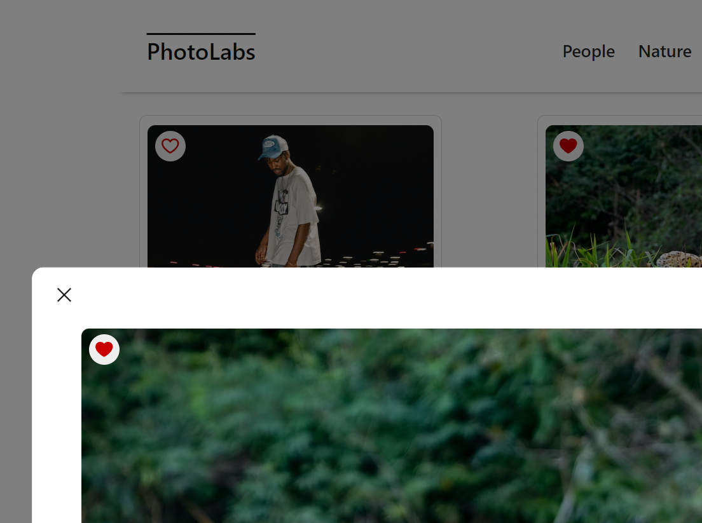

# PhotoLabs

PhotoLabs is a **React-based Single Page Application (SPA)** that allows users to explore and interact with photos dynamically. This project demonstrates a full-stack approach using **React (frontend), Node.js/Express (backend), and PostgreSQL (database).**

## **Project Overview**

### **Goal**
- Build a **client-side** application using the **React** library.
- Interact with a **Node.js Express API** to fetch and manage photo data.
- Implement **dynamic UI updates** with a responsive and modern interface.

### **Features**
- **View photos** from the homepage, loaded dynamically from the API.
- **Navigate photo categories** (topics) using a top navigation bar.
- **Click on a photo** to view its **larger version and similar photos.**
- **Like a photo** from anywhere in the application.
- **See favorite photos count** via a notification badge in the navbar.
- **Client communicates with API** over **HTTP (JSON format).**

---

## **Tech Stack**

### **Frontend**
- **React** (UI library)
- **Vite** (fast development server)
- **SCSS** (styling)
- **Jest & Testing Library** (unit testing)
- **ESLint & Prettier** (code linting and formatting)

### **Backend**
- **Node.js & Express** (server & API)
- **PostgreSQL** (database)
- **Socket.io** (real-time updates)
- **Jest & Supertest** (backend testing)

---

## **Project Structure**
```
photolabs/
│-- frontend/       # React client
│   ├── src/        # Frontend source code
│   ├── styles/     # Global styles
│   ├── components/ # React components
│   ├── package.json
│
│-- backend/        # Express server
│   ├── src/        # Backend source code
│   ├── db/         # PostgreSQL database schema
│   ├── package.json
│
│-- README.md
```

---

## **Setup Instructions**

### **Backend Setup**

[Backend Setup Instructions](/backend/)

1. Navigate to the backend folder:
   ```
   cd backend
   ```
2. Install dependencies:
   ```
   npm install
   ```
3. Configure environment variables (`.env` file):
   ```
   DATABASE_URL=postgres://development@localhost/photolabs_development
   ```
4. Initialize the database:
   ```
   npm run reset
   ```
5. Start the server:
   ```
   npm start
   ```
   The backend will run on **`http://localhost:8001`**.

---

### **Frontend Setup**

[Frontend Setup Instructions](/frontend/)

1. Navigate to the frontend folder:
   ```
   cd frontend
   ```
2. Install dependencies:
   ```
   npm install
   ```
3. Start the development server:
   ```
   npm run dev
   ```
   The frontend will run on **`http://localhost:3000`**.

---

## **Usage**

### **Running the Application**
1. Ensure the **backend** is running on `http://localhost:8001`.
2. Ensure the **frontend** is running on `http://localhost:3000`.
3. Open `http://localhost:3000` in your browser.

### **Interacting with the App**
- Click **topics in the navigation bar** to filter photos.
- Click on a **photo** to open the **PhotoDetailsModal**.
- Click **favorite (heart) button** to add/remove a photo from favorites.
- View **favorite count badge** in the top navigation.

---

## **API Reference**

| **Endpoint**                 | **Method** | **Description**                        |
|------------------------------|-----------|----------------------------------------|
| `/api/photos`                | `GET`     | Fetch all photos                      |
| `/api/topics`                | `GET`     | Fetch all photo topics                |
| `/api/topics/:id/photos`     | `GET`     | Fetch photos under a specific topic   |

---

## **Testing**
### **Backend Tests**
To run backend tests:
```
cd backend
npm test
```

### **Frontend Tests**
To run frontend tests:
```
cd frontend
npm run test
```

---

## **Future Enhancements**
- **Improve UI/UX** with animations and transitions.
- **Add user authentication** (login/logout functionality).
- **Allow users to upload photos** to the database.
- **Improve database query performance** for large datasets.

---
## **Screenshots**

### **Main Page**



### **Modal Display**



### **Favorite Image**



---

## **Contributing**
1. Fork the repository.
2. Create a new branch:
   ```
   git checkout -b feature-branch
   ```
3. Commit your changes:
   ```
   git commit -m "Add new feature"
   ```
4. Push to your branch:
   ```
   git push origin feature-branch
   ```
5. Open a Pull Request.

---

## **License**
This project is licensed under the **MIT License**.

---

## **Contact**
For any questions or issues, please open a **GitHub Issue** or contact the project maintainers.
